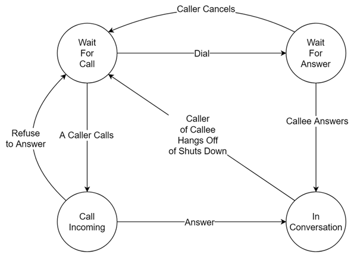

# ThunderMonkeyFrog
### Lei Hou Wa

A Simple IP Phone implemented with JavaFX frame

## Usage
The caller and callee use TCP socket to contact each other and control the conversation.
Make sure that the program isn't blocked by the Windows Firewall.
P2P only, no server needed.

## Implementation
### Finite State Machine

### Threads
Besides main thread, the following threads run during these states.
* WAIT_FOR_CALL state: 
    * CallInListenerThread
    
* CALL_INCOMING state:
    * CallerCancelListenerThread
    
* WAIT_FOR_ANSWER state:
    * AnswerListenerThread
    
* IN_CONVERSATION state:
    * ConversationControlThread
    * DatagramReceiverThread
    * DatagramSenderThread
    
### Known bugs
* When caller hangs off during a conversation, a JavaFX Application Exception probably arises.
* The callee sometimes can't sense any calling request. (Usually after a successful conversation. May be a thread synchronization issue.)

Whoever solves the issue, please contact me @<linkinpark213@outlook.com>
